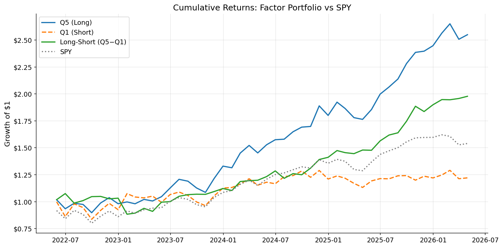

# Cross-Sectional Equity Factor Model + Walk-Forward Backtest

A Fama-French inspired multi-factor equity model that ranks S&P 500 stocks by four factor signals, constructs long-short quintile portfolios, and evaluates performance using rigorous walk-forward backtesting with transaction cost sensitivity analysis.

## Motivation

Factor premia — persistent return differences between groups of stocks sorted by characteristics — are among the most studied phenomena in quantitative finance. Two dominant explanations exist:

1. **Risk compensation**: Factor returns compensate investors for bearing systematic risk. Small stocks and value stocks are riskier (higher bankruptcy probability, procyclical earnings), so they must offer higher expected returns. (Fama & French, 1992)
2. **Behavioral mispricing**: Cognitive biases cause investors to systematically misprice certain stocks. Momentum arises from underreaction to news and herding; value from overextrapolation of past growth rates. (Jegadeesh & Titman, 1993; Lakonishok, Shleifer & Vishny, 1994)

This project builds a complete research pipeline to study whether these premia appear in recent S&P 500 data, how they interact, and whether they survive realistic transaction costs.

## Data

| Field | Detail |
|-------|--------|
| **Universe** | S&P 500 constituents (current membership list from Wikipedia) |
| **Date range** | 5 years of daily data ending today |
| **Price data** | Daily adjusted close prices and volume via yfinance |
| **Fundamentals** | Market cap and price-to-book ratio via yfinance |

**Survivorship bias caveat**: We use the *current* S&P 500 constituent list, which excludes stocks that were removed due to delisting, bankruptcy, or acquisition. This look-ahead bias systematically overstates backtested returns because it excludes the worst-performing stocks. In production, you would use point-in-time constituent lists from CRSP or Compustat.

## Factor Construction

Four factors are computed from scratch at each monthly rebalance:

### 1. Momentum (12-1 month return)
```
momentum = price[t-21] / price[t-252] - 1
```
The return over the past 12 months, **skipping the most recent month**. The skip avoids the short-term reversal effect (stocks that went up last month tend to go down this month). High momentum stocks are expected to continue outperforming — the "trend following" effect.

### 2. Value (negative price-to-book)
```
value = -1 × price_to_book_ratio
```
Low P/B stocks are "cheap" relative to their accounting book value. Negated so that high score = cheap = desirable. This is the core of the Fama-French HML (High Minus Low) factor.

### 3. Size (negative log market cap)
```
size = -1 × log(market_cap)
```
Small-cap stocks have historically outperformed large-caps. The log transformation handles the extreme right skew of market cap. Negated so high score = small = desirable. This is the Fama-French SMB (Small Minus Big) factor.

### 4. Low Volatility (negative 60-day realized vol)
```
low_vol = -1 × std(daily_returns, window=60) × sqrt(252)
```
The low-volatility anomaly: stocks with lower historical volatility deliver higher risk-adjusted returns than CAPM predicts. This contradicts the fundamental risk-return tradeoff and is one of the most robust anomalies in finance.

### Signal Processing (Adaptive)
At each monthly rebalance:
1. **Cross-sectional z-score**: Subtract mean, divide by standard deviation across all stocks
2. **Winsorize at ±3σ**: Cap extreme outliers to prevent any single stock from dominating
3. **Trailing IC computation**: For each factor, compute the Spearman rank correlation between last month's signal and this month's realized return, averaged over the trailing 12 months. This measures whether each factor is currently *working* (positive IC) or *inverted* (negative IC). Uses only past data — fully walk-forward.
4. **Adaptive sign flip**: If a factor's trailing IC is negative (e.g., value has been losing money), flip the signal direction. This prevents the model from stubbornly betting on premia that have reversed.
5. **IC-weighted composite**: Weight each factor by the magnitude of its trailing IC, shrunk 50% toward equal weights. Factors with stronger recent predictive power get more influence.
6. **Quintile ranking**: Sort stocks into Q1 (lowest composite) through Q5 (highest)

## Backtest Methodology

| Parameter | Value |
|-----------|-------|
| **Rebalance frequency** | Monthly (end of month) |
| **Portfolio weighting** | Equal-weighted within each quintile |
| **Walk-forward** | Expanding window — signals computed using only data available at decision time |
| **Transaction costs** | Swept 5–25 bps one-way |
| **Benchmark** | SPY (S&P 500 ETF) |

The walk-forward structure ensures no look-ahead bias in the backtest: at each rebalance date, every portfolio decision uses only data available at that point in time. We observe the next month's return — which was never used in signal computation — to evaluate the strategy.

## Results

*Fill in after running the pipeline. Example format:*

| Metric | Long-Short (Q5−Q1) | Q5 (Long) | Q1 (Short) | SPY |
|--------|-------------------|-----------|------------|-----|
| Annualized Return | [18.6]% | [26.4]% | [5.1]% | [11.4]% |
| Sharpe Ratio | [1.31] | [1.49] | [0.26] | [0.73] |
| Max Drawdown | [-17.8]% | [-11.8]% | [-16.2]% | [-12.9]% |
| Calmar Ratio | [1.04] | [2.23] | [0.32] | [X] | - |
| Info Ratio vs SPY | [0.27] | [1.44] | [-.46] | — |

### Cumulative Return vs SPY


### Transaction Cost Sensitivity
| Cost (bps) | Annualized Return | Sharpe |
|-----------|-------------------|--------|
| 5 | [18.0]% | [1.27] |
| 10 | [17.5]% | [1.23] |
| 15 | [16.9]% | [1.19] |
| 20 | [16.4]% | [1.15] |
| 25 | [15.8]% | [1.12] |

Strategy breaks even at approximately **[Z] bps** of one-way transaction costs.

## Limitations

This project has several important limitations that would need to be addressed in a production system:

1. **Survivorship bias**: Using the current S&P 500 membership excludes delisted and bankrupt companies, inflating returns
2. **Data snooping**: The choice of factors, lookback windows, and rebalance frequency were informed by prior academic literature, which introduces implicit data mining bias
3. **No short-selling constraints**: The backtest assumes unlimited shorting at no cost; in practice, borrow costs and availability can be significant
4. **Simplified liquidity**: We assume all stocks can be traded at the close price with no market impact, which is unrealistic for large positions
5. **Static fundamentals**: We use the latest P/B and market cap as approximations, rather than point-in-time fundamental data
6. **No transaction cost model for market impact**: Our cost model is a flat bps assumption; a proper model would account for spread, market impact as a function of trade size, and short-selling costs

## How to Run

### Prerequisites
- Python 3.9+
- Internet connection (for downloading data from Yahoo Finance)

### Installation
```bash
git clone https://github.com/YOUR_USERNAME/factor-model.git
cd factor-model
pip install -r requirements.txt
```

### Run the full pipeline
```bash
python main.py
```

This will:
1. Download 5 years of S&P 500 data (~5-15 minutes on first run)
2. Compute all four factor signals with cross-sectional z-scoring
3. Run the walk-forward backtest with quintile portfolios
4. Generate performance plots and summary statistics in `results/`

### Options
```bash
python main.py --force-download   # Re-download all data
python main.py --backtest-only    # Re-run backtest with cached data/factors
```

### Run individual modules
```bash
python data.py       # Download and clean data only
python factors.py    # Compute factor signals only
python backtest.py   # Run backtest and generate plots only
```

## Project Structure

```
factor-model/
├── data.py              # Data pipeline: download, clean, align
├── factors.py           # Factor construction: momentum, value, size, low-vol
├── backtest.py          # Backtest engine: portfolios, metrics, plots
├── main.py              # Single entry point for full pipeline
├── requirements.txt     # Python dependencies
├── README.md            # This file
├── .gitignore
├── data/                # (generated) Raw and processed data
│   ├── prices.csv
│   ├── volumes.csv
│   ├── monthly_returns.csv
│   ├── fundamentals.csv
│   └── factor_signals.csv
└── results/             # (generated) Backtest outputs
    ├── cumulative_returns.png
    ├── drawdown.png
    ├── factor_returns.png
    ├── turnover.png
    ├── tc_sensitivity.png
    ├── results_summary.txt
    ├── portfolio_returns.csv
    └── tc_sensitivity.csv
```

## References

- Fama, E. F., & French, K. R. (1992). The cross-section of expected stock returns. *The Journal of Finance*, 47(2), 427-465.
- Jegadeesh, N., & Titman, S. (1993). Returns to buying winners and selling losers. *The Journal of Finance*, 48(1), 65-91.
- Ang, A., Hodrick, R. J., Xing, Y., & Zhang, X. (2006). The cross-section of volatility and expected returns. *The Journal of Finance*, 61(1), 259-299.
- Frazzini, A., & Pedersen, L. H. (2014). Betting against beta. *Journal of Financial Economics*, 111(1), 1-25.